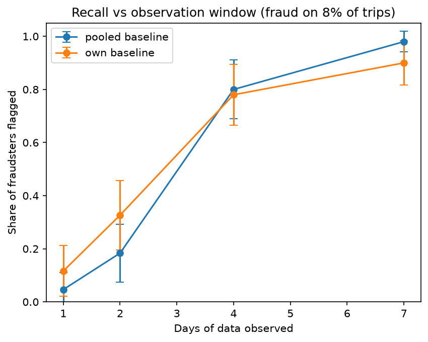
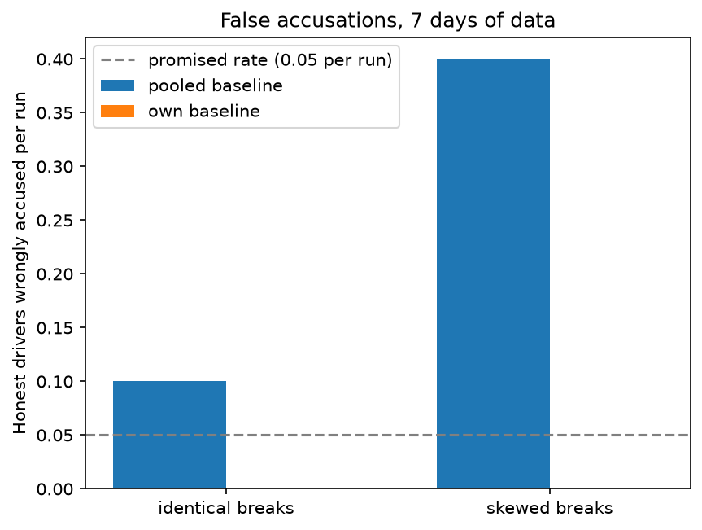

# Ride-Hailing Cancellation Fraud Detector

Detecting drivers who ask passengers to cancel a trip in the app and then keep the fare, using simulated trip data, GPS traces, and a statistical test that produces a ranked review list.

## The problem

On ride-hailing apps in Nigeria, this scam is described by riders and drivers: the driver picks up the passenger, then asks them to cancel the trip in the app. The platform logs a cancelled trip and earns no commission, while the driver keeps the full fare in cash. The trip really happened, but the record says it didn't.

I don't have access to platform data, so this project builds a simulator and tests whether a detector can find the fraud using only fields a platform would actually see.

## The simulator (`simulator.py`)

- 50 drivers, each working continuous shifts across several days, so no driver is ever in two places at once.
- About 10% of drivers are fraudsters. Each one commits fraud on a fixed share of his trips (8% in the main experiments).
- Three trip types: completed, genuine cancel (the passenger doesn't show up, the driver waits, then drives off alone), and fraud.
- Two fraud styles. **Naive:** the GPS keeps logging during the hidden trip. **Silent:** the GPS goes dark when the cancel is logged and comes back near the drop-off.
- Half of the fraud trips start moving at pickup, and half wait parked until the cancel and then drive off.
- Every driver takes random breaks. In the harder setting, honest drivers' break rates differ a lot from one another (a skewed distribution).
- The true label is stored in a hidden field (`_true_label`), used only to score the detector and never as an input to it.

## The detector (`detector.py`)

Two trip-level signals, both computed only from information a platform has:

1. **Speed before the cancel:** a car already moving in the minute before the cancel is hard to explain honestly. A parked car proves nothing, so this signal can add suspicion but never remove it.
2. **Idle time after the cancel:** a hidden trip keeps the driver busy, so his next pickup comes later than an honest driver's would.

A cancelled trip is flagged if speed is above 5 km/h or idle time is above 20 minutes.

Driver-level test: for each driver, count flags among his cancels and run a binomial test against a baseline flag rate, with a Bonferroni correction for testing many drivers. Two baselines were compared:

- **Pooled baseline:** one flag rate shared by all drivers, estimated by iteratively excluding flagged drivers.
- **Own baseline:** each driver's flag rate is estimated from his own completed trips (how often he is idle for more than 20 minutes after a trip that was not cancelled). Fraud only hides in cancelled trips, so this yardstick can't be inflated by the thing being detected.

The output is a driver table ranked by p-value, meant as a review list for a human investigator and not an automatic penalty.

## Results

Experiment: 7 days of data, 15 simulated platforms, fraud on 8% of a fraudster's trips, honest drivers with skewed break rates.

| Method | Honest drivers wrongly accused (15 runs) | Fraudsters flagged | Top-5 watchlist precision |
|---|---|---|---|
| Pooled baseline | 9 | 99% | 95% |
| Own baseline | 0 | 88% | 96% |

A watchlist chosen at random would be about 10% fraudsters, since fraudsters are 10% of drivers.





Findings:

- With a shared baseline, honest drivers who take many breaks look like fraudsters, and the test accused honest drivers far more often than its promised 5% chance per run.
- Judging each driver against his own completed-trip behavior removed the false accusations, at the cost of some recall (99% down to 88%).
- Ranking drivers by p-value needs much less evidence than accusing them. A driver can sit near the top of the list long before the evidence is strong enough to accuse.
- With fraud on only 8% of trips, the detector needs several days of data before it finds most fraudsters.

## Limitations

- All data is synthetic. The thresholds (5 km/h and 20 minutes) were chosen by looking at simulated data, so they are tuned to it. Real GPS noise, traffic, and honest behavior will overlap with fraud far more than in this simulation.
- A second scheme, cancelling a long trip and rebooking a short one to cut the commission, is not modeled. It hides inside trips that look completed, which would contaminate each driver's own baseline.
- Real fraud prevalence is unknown. Here it is set to 10% of drivers.
- A flagged driver is a lead for human review, not proof of fraud.
- The Bonferroni correction is conservative, and statistical power drops fast when a driver has few cancels.

## How to run

```
pip install -r requirements.txt
```

- `01_generate_trips.ipynb`: builds the simulator step by step and saves a sample dataset (exploratory).
- `02_feature_engineering.ipynb`: builds the detection features and rules (exploratory).
- `03_power_experiment.ipynb`: runs the experiments and saves the figures.

Quick use:

```python
import pandas as pd
from simulator import generate_dataset
from detector import run_detection

df = pd.DataFrame(generate_dataset(n_days=7, fraud_rate=0.08, varied_breaks=True))
result = run_detection(df)
print(result.sort_values('p_value_within').head(5))
```

## Files

| File | Purpose |
|---|---|
| `simulator.py` | Generates drivers, trips, and GPS traces |
| `detector.py` | Features, flags, and the driver-level statistical test |
| `*.ipynb` | Build log and experiments |
| `power_curve.png`, `false_accusations.png` | Result figures |

## Possible next steps

- Compare the hand-built rules to a logistic regression trained on the same trip features.
- Model the fare-splitting scheme and test whether the detector still works.
- Replace the simulation's tidy thresholds with realistic GPS noise.
